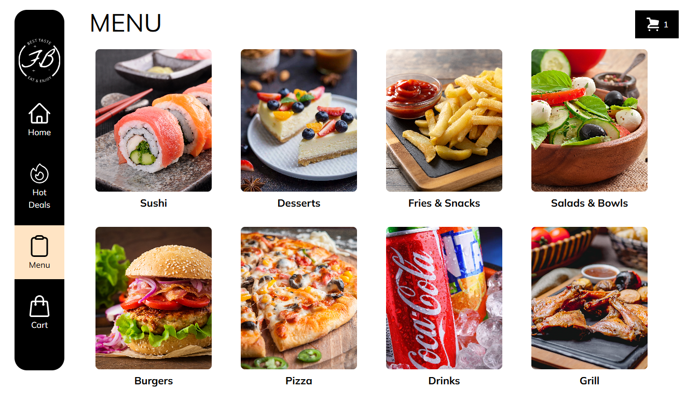
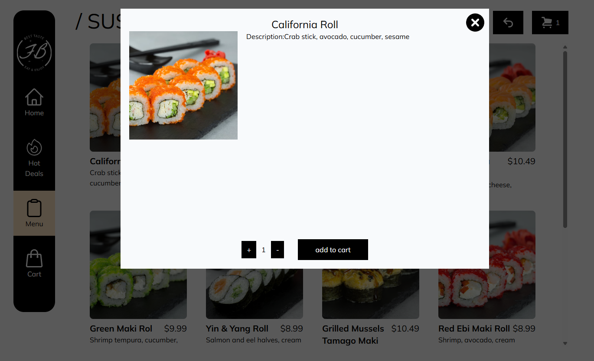
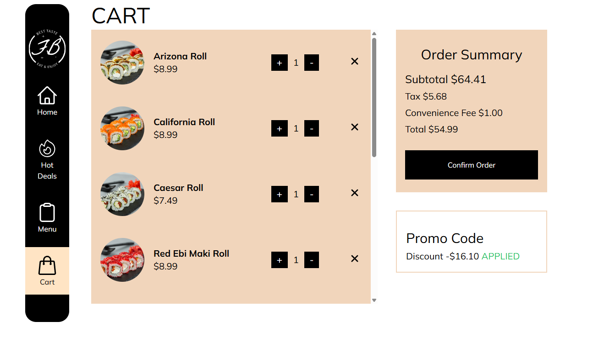
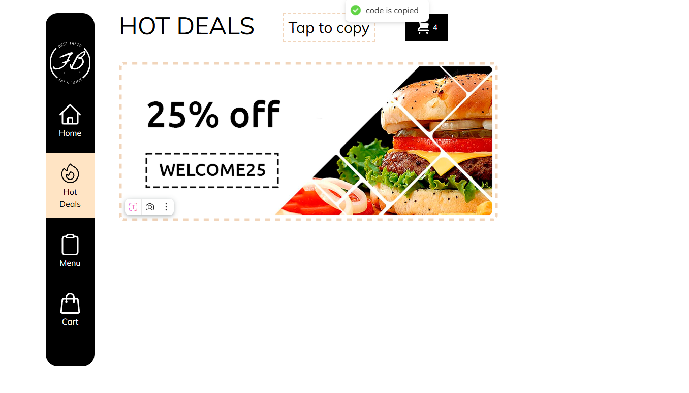

# Restaurant Catalog Lite

A production-like slice of a restaurant app: categorized menu with images, cart, promo codes, taxes/fees, and a lightweight admin (manager/kitchen). Built to demonstrate practical frontend + minimal backend integration and quality basics (state, types, routing, auth, storage, deploy).

**Live:** https://ya-sushi2.netlify.app/  
**Repo:** https://github.com/Alexander-webov/restaurant-catalog-lite

<p>
  
  
</p>
<p>
  
  
</p>

---

## TL;DR — Why this project?

- Realistic feature slice you’d ship at work: cart, discounts, derived totals, admin flows.
- Clean TypeScript types, Redux Toolkit for predictable state, Supabase Storage uploads.
- Simple, reliable deploy on Netlify with SPA routing.

---

## Features

### Customer

- Browse menu by category with images and prices
- Cart: add/remove, increment/decrement, empty state
- Promo codes with validation and toast feedback
- Derived totals: **subtotal → discount → tax → convenience fee → grand total**
- Responsive UI (mobile-first), accessible focus states

### Admin / Back-of-House

- Minimal **email/password auth** via Supabase
- Route protection (manager/kitchen pages)
- CRUD for **categories** and **items**:
  - Create/update/delete with FK error handling
  - Image upload to **Supabase Storage** (public bucket) and immediate preview
- Storage RLS policies: `INSERT/UPDATE` for `authenticated`, `SELECT` for `public`

---

## Tech Stack

- **React 18 + Vite**, **TypeScript**
- **Redux Toolkit** (cart/promo slices + selectors)
- **React Router v6**
- **Tailwind CSS**
- **Supabase** (Auth, Storage, PostgREST)
- **react-hot-toast** (UX feedback)

---

## Project Tour

src/
app/
store.ts # Redux store
hooks.ts # typed hooks
features/
cart/ # cart slice + selectors
promo/ # promo slice
pages/
MenuCategoryPage.tsx
AdminPanel/...
shared/
api/ # Supabase calls (items, categories, storage, auth)
lib/ # utilities (money formatting, etc.)
ui/ # reusable UI components
types/
item.ts # Item / NewItemInput, etc.

- **State**: minimal, domain-oriented RTK slices, memoized selectors for totals
- **Types**: separate types for DB rows vs. insert payloads (`Item` vs `NewItemInput`)
- **Storage**: simple public-bucket flow (upload → `getPublicUrl` → store `image_url`) — easy to switch to signed URLs later

---

## Getting Started

### Prerequisites

- Node.js 18+

### Install

```bash
npm i
# or
pnpm i
```

## Env

```

Create .env.local:

VITE_SUPABASE_URL=https://<your-project>.supabase.co
VITE_SUPABASE_ANON_KEY=<your-anon-key>

```

## Supabase quick setup

Create a project at https://app.supabase.com

Auth → Email: enable, auto-confirm (for demo)

Storage → New bucket: categories (Public ON)

Storage → Policies (bucket: categories)

INSERT/UPDATE → role authenticated, condition: bucket_id = 'categories'

SELECT → role public, condition: bucket_id = 'categories'

Tables

categories: id, name, slug, image_url (text, nullable)

items: id, name, slug, description (text, nullable), image (text, nullable), price_cents (int)

## Dev

npm run dev

# or

pnpm dev

## Build & Preview

npm run build && npm run preview

# or

pnpm build && pnpm preview

## Architecture Notes

Route protection: Protected checks supabase.auth.getSession() and subscribes to onAuthStateChange; redirects unauthenticated users to /login?redirect=…

Uploads: unique filename → upload to categories bucket → getPublicUrl → persist image_url → instant preview

Errors: FK violations surface user-friendly messages; RLS errors prompt login/policy checks

DX: strict TS, utilities for money formatting, clean Tailwind classes

## Deployment

Netlify with SPA redirect:

Build: tsc -b && vite build

Publish: dist/

\_redirects or netlify.toml route /\* → /index.html 200

Set VITE_SUPABASE_URL and VITE_SUPABASE_ANON_KEY in Site settings → Build & deploy → Environment

## Author

Alexander Webov — Frontend Engineer
Repo: https://github.com/Alexander-webov/restaurant-catalog-lite

Live: https://ya-sushi2.netlify.app/
